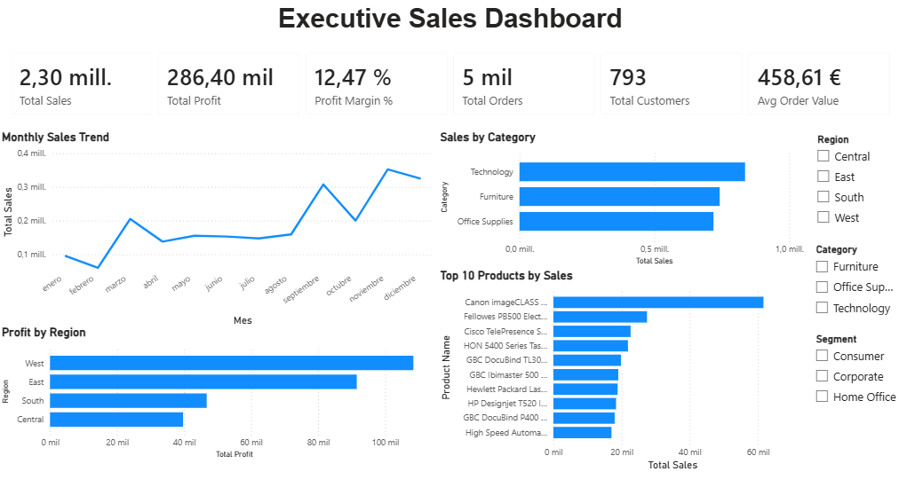

# 📊 Executive Sales Dashboard

An end-to-end Data Analytics project that transforms raw sales data into actionable business insights using Python, PostgreSQL, SQL, and Power BI.

The project demonstrates a complete analytics workflow, from data preparation and database management to interactive dashboard development and KPI reporting.



---

# 📌 Descripción general del proyecto

Este proyecto está basado en el conocido conjunto de datos Sample Superstore y tiene como objetivo analizar el rendimiento de las ventas desde diferentes perspectivas, como productos, clientes, regiones y periodos de tiempo.

El objetivo es desarrollar una solución completa de Business Intelligence, capaz de responder a preguntas clave del negocio mediante un dashboard interactivo en Power BI.

El proyecto sigue un flujo completo de trabajo de ETL y Business Intelligence:

- Extract data from the Sample Superstore Excel file
- Transform and clean the data using Python (Pandas)
- Export the cleaned dataset as a CSV file
- Load the processed data into PostgreSQL
- Perform business analysis using SQL
- Build an interactive dashboard in Power BI
- Create business KPIs using DAX

---

# 🛠️ Tech Stack

| Technology | Purpose |
|------------|---------|
| Python | Data preparation |
| Pandas | Data cleaning & transformation |
| PostgreSQL | Database |
| SQL | Business analysis |
| Power BI | Dashboard & visualization |
| DAX | KPI calculations |
| Git | Version control |
| GitHub | Portfolio hosting |

---

# 📂 Project Structure

```text
01-sales-analytics/
│
├── data/
│   ├── raw/
│   │   └── Sample-Superstore.xlsx
│   │
│   └── processed/
│       └── superstore.csv
│
├── images/
│   │   └── dashboard.png
│
├── notebooks/
│
├── powerbi/
│   └── Executive_Sales_Dashboard.pbix
│
├── scripts/
│   └── prepare_data.py
│
├── sql/
│   ├── 01_create_database.sql
│   ├── 02_business_queries.sql
│   ├── 03_aggregations.sql
│   └── 04_window_functions.sql
│
├── tableau/
│
├── requirements.txt
├── .gitignore
└── README.md
```


# 🔄 Data Pipeline

```text
        Sample-Superstore.xlsx
                  │
                  ▼
        Python (Pandas ETL)
                  │
                  ▼
          superstore.csv
                  │
                  ▼
      PostgreSQL Database
                  │
                  ▼
          SQL Analysis
                  │
                  ▼
      Power BI Dashboard
                  │
                  ▼
       Business Insights
```

---

# 📈 Indicadores clave de rendimiento

El panel de control incluye los siguientes KPIs:

- Total Sales
- Total Profit
- Profit Margin (%)
- Total Orders
- Total Customers
- Average Order Value

---

# 💡 Preguntas de negocio que responde el dashboard

El dashboard permite responder a importantes preguntas de negocio, como:

- Which product categories generate the highest sales?
- Which regions are the most profitable?
- How have sales evolved over time?
- Which products generate the highest revenue?
- What is the overall profit margin?
- How do customer purchasing patterns vary across segments?

---

# 🎯 Habilidades demostradas

Durante el desarrollo de este proyecto se pusieron en práctica las siguientes competencias:

- Data Cleaning with Pandas
- Data Transformation
- PostgreSQL Database Management
- SQL Query Development
- KPI Design
- DAX Measures
- Interactive Dashboard Development
- Business Intelligence Reporting
- Data Visualization
- End-to-End Analytics Workflow

---

# 🚀 ¿Cómo ejecutar el proyecto?

### 1. Clonar el repositorio

git clone https://github.com/javiercobosanchez/sales-analytics-dashboard.git


### 2. Instalar las dependencias necesarias


```bash
pip install -r requirements.txt
```

### 3. Ejecutar el script de preparación de datos

```bash
python scripts/prepare_data.py
```
### 4. Crear la base de datos en PostgreSQL

Ejecutar los scripts SQL ubicados en la carpeta **sql/**

### 5. Abrir el dashboard

Abrir el archivo **Executive_Sales_Dashboard.pbix** con Power BI Desktop

---

# 📌 Mejoras futuras

Las posibles mejoras para futuras versiones del proyecto incluyen:

- Star Schema implementation
- Calendar table for advanced time intelligence
- Advanced DAX calculations (YTD, MTD, YOY)
- Drill-through report pages
- Power BI Service deployment
- Tableau implementation
- Automated ETL pipeline

---

## 👨‍💻 Author

**Javier Cobo**

- GitHub: https://github.com/javiercobosanchez
- LinkedIn: https://www.linkedin.com/in/javiercobosanchez/

2026
